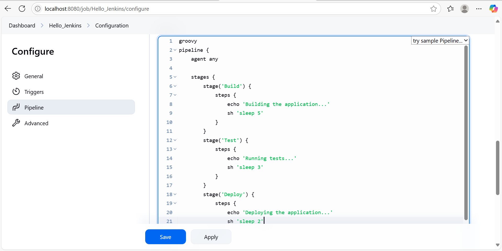

# Jenkins_Assignment 
###**Easy:**
In this Assignment we are just exploring and trying the basic features of Jenkins like what does jenkins do and how to use it and all.
So basically you can install Jenkins Application in a docker container using this command
```sh
docker run -p 8080:8080 -p 50000:50000 -d -v jenkins_home:/var/jenkins_home jenkins/jenkins:lts
```
You will now run the jenkins in your docker container just access jenkins by following the lead and once you open jenkins it looks like this


Now we have to create a new Job named Hello_Jenkins to just understand the basics of Jenkins
Create a new Job and then create and select a Pipeline  and add some description and then proceed to the pipeline code which is written in the .groovy file extension and click on save
 
 
 
 


After this press on build to get the pipeline to be built


After pressing build It looks something like this


For successful Execution we can check the console output by selecting it


As we can see its success which means it got executed without any errors.
We can Also see the Pipeline overview by selecting an option in the Jobs


Now we have to add some changes into Pipeline by selecting configure in the jobs sections


The change we are adding is cleanup stage in the pipeline groovy program.


After adding the change press save and build it to get 2# build with updated change 


We can Observe the change in the Pipeline as we have added another stage in it.


###**End Of Assignment**
